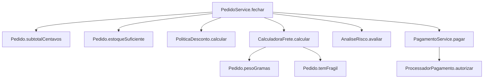
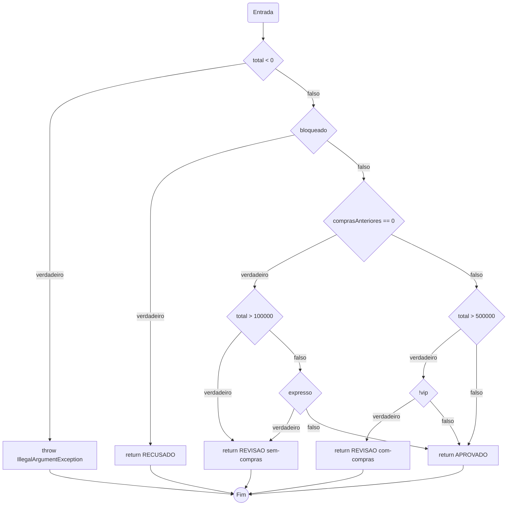
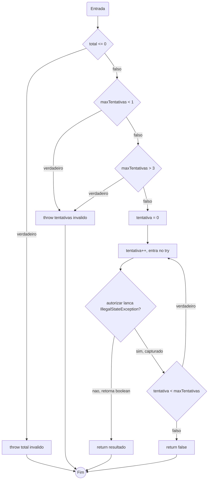

# Relatório do grupo

Integrantes:

## Convenções adotadas

- Curto-circuito (`&&`/`||`): cada operando vira um nó de decisão separado. O segundo operando só aparece no grafo ligado à aresta "primeiro operando não decidiu sozinho" (ex.: em `a || b`, o nó de `b` só é alcançado pela aresta `a=falso`; em `a && b`, o nó de `b` só é alcançado pela aresta `a=verdadeiro`).
- `switch`: decomposto como uma cadeia `if/else if` equivalente. Quando dois `case` compartilham o mesmo corpo (ex.: `SP`/`RJ` em `CalculadoraFrete`), cada rótulo continua sendo um teste de igualdade próprio, porque o desvio para o corpo comum depende de duas comparações possíveis, não de uma só.
- `try/catch`: a chamada protegida vira um nó de decisão com duas saídas — "retornou normalmente" e "lançou a exceção tratada" (`IllegalStateException` em `PagamentoService`). Uma exceção **não tratada** (ex.: `RuntimeException` genérica) não é modelada como aresta do grafo: ela interrompe o método de forma abrupta, fora do fluxo estruturado — ver Análise crítica.
- Todos os grafos têm saída unificada (nó `Fim`), para o qual convergem todos os `return` e `throw`.
- `V(G) = decisões + 1` é usado como atalho depois de confirmado por contagem completa de nós/arestas em dois métodos (`AnaliseRisco.avaliar` e `PagamentoService.pagar`), já que os grafos aqui são estruturados (uma entrada, decisões binárias, saída única).

## Grafo de chamadas de `PedidoService.fechar`

## Grafos e complexidade

### `AnaliseRisco.avaliar` — contagem completa (nós e arestas)

Nós = 14, arestas = 20 → `V(G) = 20 − 14 + 2 = 8`, igual a decisões (7) + 1.

### `PagamentoService.pagar` — contagem completa (nós e arestas)

Nós = 13, arestas = 17 → `V(G) = 17 − 13 + 2 = 6`, igual a decisões (5) + 1.

### Demais métodos — decisões enumeradas (atalho decisões + 1)

**`PoliticaDesconto.calcular`** — decisões: subtotal negativo; `vip`; `subtotal>=50000` (else-if); `cupom==null`; `cupom.isBlank()`; `==BEMVINDO`; `==EXTRA10` (else-if); `comprasAnteriores==0` (dentro de BEMVINDO); `subtotal>=10000` (segundo operando do `&&`, só avaliado se o anterior for verdadeiro); `subtotal>=20000` (dentro de EXTRA10); teto (`desconto>teto`, ternário). Total: **11 decisões → V(G) = 12**.

**`CalculadoraFrete.calcular`** — decisões: `liquido<0`; `uf==PR`; `uf==SP`; `uf==RJ` (só avaliado se `uf==SP` for falso); `while(excedente>0)`; `liquido>=30000`; `!expresso` (segundo operando do `&&`, só avaliado se o anterior for verdadeiro); `vip`; `expresso`; `temFragil`. Total: **10 decisões → V(G) = 11**.

**`PedidoService.fechar`** — decisões: `pedido==null`; `cliente==null`; `bloqueado`; `subtotal==0`; `!estoqueSuficiente`; `!analise.equals("APROVADO")`; ternário do resultado de `pagar` (`PAGO`/`PAGAMENTO_RECUSADO`). Total: **7 decisões → V(G) = 8**.

### Tabela resumo

| Método | Nós | Arestas | V(G) | Caminhos independentes | Restrições de viabilidade |
| --- | --- | --- | --- | --- | --- |
| `PoliticaDesconto.calcular` | não contado célula a célula (atalho justificado) | — | 12 | 12 | Nenhuma — todas as combinações de decisão são alcançáveis com dados válidos. |
| `CalculadoraFrete.calcular` | — | — | 11 | 11 | Isenção (`liquido>=30000 && !expresso`) e adicional de expresso (`+1500`) nunca coexistem no mesmo caminho: a isenção exige `expresso==false`, condição oposta à do adicional. Não é um caminho inviável do grafo (as duas decisões são independentes na estrutura), mas é uma combinação de **dados** impossível de realizar — ver Análise crítica. |
| `AnaliseRisco.avaliar` | 14 | 20 | 8 | 8 | Nenhuma isoladamente; porém o caminho que retorna `RECUSADO` nunca é alcançado quando este método é chamado a partir de `PedidoService.fechar` — ver Análise crítica. |
| `PagamentoService.pagar` | 13 | 17 | 6 | 6 | O laço `do/while` tem, em tese, infinitas variações de nº de iterações; a base usa apenas "falha uma vez e recupera" e "esgota tentativas" como representantes. |
| `PedidoService.fechar` | não contado célula a célula (atalho justificado) | — | 8 | 8 | Nenhuma — todos os 8 caminhos são alcançáveis com combinações válidas de cliente/pedido/stub. |

## Base de caminhos independentes e matriz de testes

### `PoliticaDesconto.calcular` (12 caminhos)

| ID | Caminho (decisões) | Dado que realiza | Teste JUnit |
| --- | --- | --- | --- |
| PD1 | subtotal < 0 → exceção | subtotal=-1 | `lancaExcecaoQuandoSubtotalNegativo` |
| PD2 | vip, cupom nulo → retorno direto | vip, subtotal=100000, cupom=null | `vipSemCupomRecebeDezPorCentoSemLimite` |
| PD3 | comum, subtotal<50000, cupom nulo | subtotal=49999 | `comumComSubtotalAbaixoDoLimiteNaoTemDesconto` |
| PD4 | comum, subtotal>=50000, cupom nulo | subtotal=50000 | `comumComSubtotalNoLimiteRecebeCincoPorCento` |
| PD5 | cupom em branco → retorno direto, sem teto | vip, cupom="   " | `cupomEmBrancoMantemDescontoBaseSemAplicarTeto` |
| PD6 | BEMVINDO elegível | comprasAnteriores=0, subtotal=10000 | `cupomBemVindoNormalizadoComEspacosEMinusculasSomaVinteReais` |
| PD7 | BEMVINDO, `&&` curto-circuita no 1º operando | comprasAnteriores=1 | `cupomBemVindoNaoElegivelPorTerComprasAnteriores` |
| PD8 | BEMVINDO, 1º operando true, 2º false | comprasAnteriores=0, subtotal=9999 | `cupomBemVindoNaoElegivelPorSubtotalAbaixoDoLimite` |
| PD9 | EXTRA10 elegível | subtotal=20000 | `cupomExtra10ElegivelSomaDezPorCento` |
| PD10 | EXTRA10 não elegível | subtotal=19999 | `cupomExtra10NaoElegivelPorSubtotalAbaixoDoLimite` |
| PD11 | cupom desconhecido → exceção | cupom="NATAL" | `cupomDesconhecidoLancaExcecao` |
| PD12 | teto aplicado (desconto > 20%) | vip + BEMVINDO, subtotal=10000 | `descontoCombinadoEhLimitadoAVintePorCentoDoSubtotal` |

Teste extra (reforço, não é um caminho novo da base): `truncaDescontoPercentualParaBaixo` reexecuta PD2 com subtotal=333 para expor o truncamento de `333*10/100=33`.

### `CalculadoraFrete.calcular` (11 caminhos)

| ID | Caminho (decisões) | Dado que realiza | Teste JUnit |
| --- | --- | --- | --- |
| CF1 | liquido < 0 → exceção | liquido=-1 | `lancaExcecaoQuandoLiquidoNegativo` |
| CF2 (base) | PR, sem excedente, sem isenção/vip/expresso/frágil | peso=500g, liquido=1000 | `baseParanaComPesoAbaixoDoLimite` (reforço no limite exato: `pesoExatamenteNoLimiteNaoAdicionaExcedente`) |
| CF3 | UF != PR, == SP | uf="SP" | `baseSaoPaulo` |
| CF4 | UF != PR/SP, == RJ | uf="RJ" | `baseRioDeJaneiro` |
| CF5 | UF fora de PR/SP/RJ (default) | uf="MG" | `baseOutraUfUsaTarifaPadrao` |
| CF6 | laço executa (peso acima do limite) | peso=2500g | `pesoComFracaoAcimaDoLimiteCobraUmaFaixaInteira` (reforço com várias iterações: `pesoComVariasFaixasSomaTodasAsIteracoes`) |
| CF7 | isenção aplicada | liquido=30000, expresso=false | `isencaoZeraFreteQuandoLiquidoAltoENaoExpresso` |
| CF8 | 1º operando da isenção true, 2º false (expresso trava) | liquido=30000, expresso=true | `isencaoNaoSeAplicaQuandoEntregaEhExpressa` |
| CF9 | vip aplicado | vip, liquido=1000 | `vipPagaMetadeDoFrete` |
| CF10 | adicional de expresso aplicado | expresso=true, liquido=1000 | `expressoAdicionaValorFixo` |
| CF11 | adicional de item frágil aplicado | item frágil ativo | `itemFragilAdicionaValorUmaUnicaVezMesmoComVariosItens` |

Testes extra (reforço de nuances, não são caminhos novos da base): `isencaoNaoSeAplicaQuandoLiquidoAbaixoDoLimite` (reforça CF2 com liquido baixo), `vipComFreteIsentoContinuaZerado`, `itemFragilInativoNaoAdicionaValor`, `adicionalDeItemFragilIncideMesmoComBaseZeradaPelaIsencao` e `adicionaisDeExpressoEFragilNaoSaoDivididosPelaMetadeDoVip` — este último prova a ordem de aplicação (isenção → vip → expresso → frágil).

### `AnaliseRisco.avaliar` (8 caminhos)

| ID | Caminho | Dado | Teste JUnit |
| --- | --- | --- | --- |
| AR1 | total < 0 → exceção | total=-1 | `lancaExcecaoQuandoTotalNegativo` |
| AR2 | bloqueado → RECUSADO | bloqueado=true | `bloqueadoRetornaRecusadoIndependenteDoTotal` |
| AR3 | sem compras, total > 100000 → REVISAO | comprasAnteriores=0, total=100001 | `semComprasAnterioresEComTotalAcimaDoLimiteRetornaRevisao` |
| AR4 | sem compras, total <= 100000, expresso → REVISAO | total=0, expresso=true | `semComprasAnterioresEExpressoRetornaRevisaoMesmoComTotalBaixo` |
| AR5 | sem compras, total <= 100000, não expresso → APROVADO | total=100000 | `semComprasAnterioresEComTotalNoLimiteRetornaAprovado` |
| AR6 | com compras, total > 500000, não vip → REVISAO | comprasAnteriores=1, total=500001 | `comComprasAnterioresEComTotalAcimaDoLimiteENaoVipRetornaRevisao` |
| AR7 | com compras, total > 500000, vip → APROVADO | vip=true, total=500001 | `comComprasAnterioresEComTotalAcimaDoLimiteEVipRetornaAprovado` |
| AR8 | com compras, total <= 500000 → APROVADO | total=500000 | `comComprasAnterioresEComTotalNoLimiteRetornaAprovado` |

### `PagamentoService.pagar` (6 caminhos)

| ID | Caminho | Dado | Teste JUnit |
| --- | --- | --- | --- |
| PS1 | total <= 0 → exceção | total=0 (e -1) | `lancaExcecaoQuandoTotalZero`, `lancaExcecaoQuandoTotalNegativo` |
| PS2 | maxTentativas < 1 → exceção | maxTentativas=0 | `lancaExcecaoQuandoMaxTentativasAbaixoDoLimite` |
| PS3 | maxTentativas > 3 → exceção | maxTentativas=4 | `lancaExcecaoQuandoMaxTentativasAcimaDoLimite` |
| PS4 | aprova na 1ª tentativa | stub sempre `true` | `aprovaNaPrimeiraTentativa` (reforço: `recusaImediataSemRepetir` com `false`) |
| PS5 | lança indisponibilidade, repete, aprova | stub lança na 1ª, aprova na 2ª | `tentaNovamenteAposIndisponibilidadeEDepoisAprova` |
| PS6 | esgota tentativas sempre indisponível | stub sempre lança | `esgotaComUmaUnicaTentativaQuandoLimiteEUm` (reforço com 3 tentativas: `esgotaTentativasQuandoSempreIndisponivelERetornaFalso`) |

Fora da base estruturada (ver Análise crítica): `propagaExcecaoDiferenteDeIndisponibilidadeSemRepetir`.

### `PedidoService.fechar` (8 caminhos)

| ID | Caminho | Dado | Teste JUnit |
| --- | --- | --- | --- |
| FE1 | pedido nulo → NPE | pedido=null | `deveLancarNullPointerQuandoPedidoNulo` |
| FE2 | cliente nulo → NPE | cliente=null | `deveLancarNullPointerQuandoClienteNulo` |
| FE3 | bloqueado → BLOQUEADO, sem avaliar itens/cupom | bloqueado=true, cupom inválido | `deveRetornarBloqueadoAntesDeAvaliarItensOuCupom` |
| FE4 | subtotal ativo zero → exceção | item com quantidade=0 | `deveLancarExcecaoQuandoSubtotalAtivoForZero` |
| FE5 | estoque insuficiente → SEM_ESTOQUE, antes do cupom | item indisponível, cupom inválido | `deveRetornarSemEstoqueAntesDeValidarCupom` |
| FE6 | risco não aprovado → retorna sem cobrar | total alto, sem compras anteriores | `deveRetornarRevisaoComValoresCalculadosESemCobranca` |
| FE7 | aprovado, pagamento aceito → PAGO | stub aprova | `deveFecharPedidoDeClienteComumComFreteDoParanaEPagamentoAprovado` (exemplo) e `deveRetornarPagoComDescontoNoTetoEFreteZeradoPelaIsencao` |
| FE8 | aprovado, pagamento recusado → PAGAMENTO_RECUSADO | stub recusa (imediato ou após esgotar tentativas) | `deveRetornarPagamentoRecusadoQuandoProcessadorNegaImediatamente`, `deveRetentarPagamentoAteTresVezesEDepoisRecusarQuandoProcessadorIndisponivel` |

## Matriz de testes (amostra representativa — objetos de valor)

Os testes de `Cliente`, `ItemPedido` e `Pedido` não têm CFG próprio (são validações de construtor e laços simples de soma/filtro), mas seguem o mesmo critério de fronteira. Amostra:

| ID / método JUnit | Unidade | Entrada e estado do stub | Resultado esperado | Caminho / aresta | Critério atendido |
| --- | --- | --- | --- | --- | --- |
| `ItemPedidoTest.aceitaPrecoNoLimiteMinimo` | `ItemPedido` | preco=1 | constrói sem exceção | limite inferior válido | fronteira |
| `ItemPedidoTest.lancaExcecaoQuandoPrecoAcimaDoLimite` | `ItemPedido` | preco=1_000_001 | `IllegalArgumentException` | limite superior inválido | fronteira |
| `PedidoTest.aceitaListaComExatamenteCemItens` | `Pedido` | 100 itens | constrói sem exceção | limite da lista | fronteira |
| `PedidoTest.lancaExcecaoQuandoListaTemMaisDeCemItens` | `Pedido` | 101 itens | `IllegalArgumentException` | acima do limite | fronteira |
| `PedidoTest.lancaNullPointerQuandoItemDaListaENulo` | `Pedido` | lista com elemento nulo | `NullPointerException` | `List.copyOf` propaga NPE | tratamento de exceção não checado |
| `PedidoTest.copiaListaDefensivamente` | `Pedido` | lista mutável, alterada após construção | `pedido.itens()` inalterado | cópia defensiva | efeito observável, não só ausência de exceção |
| `PedidoTest.estoqueSuficienteRetornaVerdadeiroParaListaVazia` | `Pedido` | lista vazia | `true` | 0 iterações do `for` | laço, zero repetições |

As tabelas por método nas seções anteriores cobrem o restante (`PoliticaDesconto`, `CalculadoraFrete`, `AnaliseRisco`, `PagamentoService`, `PedidoService`) com o mesmo nível de detalhe.

## Evolução da cobertura

Medido rodando `mvn clean test` com subconjuntos de classes via `-Dtest`, sem alterar nenhuma implementação.

| Etapa | Testes executados | Linhas | Branches | Métodos | Classes | Lacunas e justificativas |
| --- | --- | --- | --- | --- | --- | --- |
| Inicial | 0 | Não medido | Não medido | Não medido | Não medido | Sem testes |
| Exemplo fornecido (`PedidoServiceTest`, 1 teste) | 1 | 87/108 (80,6%) | 50/116 (43,1%) | 20/21 (95,2%) | 9/9 (100%) | Só o caminho feliz de `fechar` é exercitado; `PoliticaDesconto`, `CalculadoraFrete` e `AnaliseRisco` têm a maior parte dos ramos descoberta. Classes já aparecem 100% porque um construtor chamado já conta, conforme a nota do `README.md`. |
| + Objetos de valor (`Cliente`, `ItemPedido`, `Pedido` + exemplo, 44 testes) | 44 | 89/108 (82,4%) | 69/116 (59,5%) | 20/21 (95,2%) | 9/9 (100%) | `Cliente`, `ItemPedido` e `Pedido` chegam a 100%; os colaboradores (`PoliticaDesconto`, `CalculadoraFrete`, `AnaliseRisco`, `PagamentoService`) e o método auxiliar `semCobranca` de `PedidoService` continuam descobertos. |
| Final (todas as classes de teste, 104 testes) | 104 | 108/108 (100%) | 116/116 (100%) | 21/21 (100%) | 9/9 (100%) | Nenhuma lacuna. |

## Análise crítica

**Quais combinações faltavam mesmo com os ramos cobertos?**
Cobrir os dois lados de cada `if` de `CalculadoraFrete.calcular` isoladamente não garante as combinações reais: por exemplo, "isenção aplicada" e "adicional de frágil aplicado" juntos só foram exercitados por um teste dedicado (`adicionalDeItemFragilIncideMesmoComBaseZeradaPelaIsencao`), porque a ordem do código (isenção → vip → expresso → frágil) significa que o adicional de frágil incide *depois* da base já ter sido zerada. Um teste que cobrisse os dois ramos separadamente, sem combiná-los, não teria pego um eventual bug em que o frágil fosse somado *antes* da isenção zerar tudo.

**Quais condições não foram avaliadas devido ao curto-circuito?**
Em `PoliticaDesconto`, quando `cliente.comprasAnteriores() != 0` (cupom `BEMVINDO`), o `&&` nunca avalia `subtotal >= 10_000` — o teste `cupomBemVindoNaoElegivelPorTerComprasAnteriores` usa `subtotal=10_000` (que seria elegível) justamente para isolar que a reprovação vem do primeiro operando. Em `AnaliseRisco`, quando `total > 100_000` já é verdadeiro, `expresso` nunca é avaliado (`semComprasAnterioresEComTotalAcimaDoLimiteRetornaRevisao` usa `expresso=false` para provar isso). Em `CalculadoraFrete`, quando `liquido < 30_000`, `!pedido.expresso()` nunca é avaliado — coberto por `isencaoNaoSeAplicaQuandoLiquidoAbaixoDoLimite`.

**Quais caminhos são inviáveis no serviço, mas viáveis na unidade?**
O retorno `"RECUSADO"` de `AnaliseRisco.avaliar` (cliente bloqueado) é plenamente testável isolado (`bloqueadoRetornaRecusadoIndependenteDoTotal`), mas **nunca** é alcançado a partir de `PedidoService.fechar`: o serviço já retorna `"BLOQUEADO"` antes de sequer calcular o subtotal ou chamar `risco.avaliar`, então esse ramo de `AnaliseRisco` fica "morto" do ponto de vista de colaboração, apesar de coberto na unidade. De forma semelhante, a combinação "isenção de frete" + "adicional de expresso" é impossível de realizar com qualquer dado: a isenção exige `!pedido.expresso()`, e o adicional de expresso exige `pedido.expresso()` — são a mesma flag do mesmo pedido, então não existe entrada que ative os dois ao mesmo tempo (isso não é uma restrição do grafo do serviço, é uma restrição estrutural do próprio método `CalculadoraFrete.calcular`).

**Como foram testadas exceções e quantidades de iterações?**
Exceções tratadas (`IllegalStateException` em `PagamentoService`) foram testadas com stubs contadores que lançam na primeira chamada e depois aprovam (`tentaNovamenteAposIndisponibilidadeEDepoisAprova`) e que lançam sempre até esgotar (`esgotaTentativasQuandoSempreIndisponivelERetornaFalso`, `esgotaComUmaUnicaTentativaQuandoLimiteEUm`). Exceções **não tratadas** (`RuntimeException` genérica) foram testadas separadamente (`propagaExcecaoDiferenteDeIndisponibilidadeSemRepetir`) verificando que a exceção se propaga e que não houve nova tentativa — esse cenário não é contado como branch pelo JaCoCo (conforme o aviso do `README.md`), porque não existe uma aresta condicional explícita no bytecode para "exceção não capturada": é uma saída abrupta do método, fora do fluxo estruturado do `do/while`. O laço `while` de `CalculadoraFrete` foi testado com zero iterações (peso ≤ 2kg), uma iteração com fração (2,5kg) e várias iterações exatas (5kg → 3 voltas). O `do/while` de `PagamentoService` foi testado com 1, 2 e o máximo de 3 tentativas.

**Qual alteração proposital foi detectada por qual teste? A alteração foi desfeita?**
Em `PoliticaDesconto.java`, a linha `desconto = subtotal * 10 / 100;` (desconto VIP) foi alterada temporariamente para `* 9 / 100`. Rodando `mvn clean test`, 4 testes falharam imediatamente: `PoliticaDescontoTest.vipSemCupomRecebeDezPorCentoSemLimite` (esperava 10000, obteve 9000), `PoliticaDescontoTest.cupomEmBrancoMantemDescontoBaseSemAplicarTeto` (esperava 1000, obteve 900), `PoliticaDescontoTest.truncaDescontoPercentualParaBaixo` (esperava 33, obteve 29) e `PedidoServiceTest.deveRetornarPagoComDescontoNoTetoEFreteZeradoPelaIsencao` (o desconto combinado deixou de bater exatamente no teto de 20%, o que também mudou o frete calculado a partir do líquido). A alteração foi desfeita em seguida e `mvn clean test` voltou a passar com 104/104 testes e 100% de cobertura.
